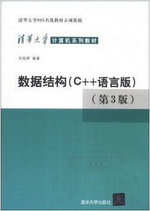

## 为什么

- 本仓库旨在跟踪本人备考2024计算机考研其中数据结构课程的学习进度,以**严蔚敏主编的数据结构双色版及配套的实验指导**、**邓俊辉版数据结构（C++语言版第3版）**以及**2024王道数据结构考研辅导书**为参考教材

- **基础源码**(数据结构的基本操作)将会以`class`的形式给出，一个`.cpp`文件和一个`.h`文件，在*ipad*上下载**GitHub**应用软件，零散时间可快速打开温习代码，**习题解答**和**应用案例**会另给出一个`main.cpp`文件用于测试

- 每个文件夹里面含两个文件`TextBook`和`Exercise`，前者包括**基础源码**和**应用案例**的源码，后者包含**习题解答**的代码

- 代码主要以**严书**的为主，同时会补充邓书和王道的代码，遇到**完全重复**的算法时，**采用严书的实现方式**

- 命名方式、代码规范选用**严书标准**

- 开箱即用，下载后可以很轻松嵌入`main`函数中自行调试

------


## 教材源码

|                 绪论                 |                            线性表                            |                           栈和队列                           | 串、数组和广义表 | 树和二叉树 |  图  | 查找 | 排序 |
| :----------------------------------: | :----------------------------------------------------------: | :----------------------------------------------------------: | :--------------: | :--------: | :--: | ---- | :--: |
| <a href="Status/Status.h">状态码</a> |   <a href="02-Linear List/TextBook/SqList.cpp">顺序表</a>    | <a href="03-Stack and Queue/TextBook/SqStack.cpp">顺序栈</a> |                  |            |      |      |      |
|                                      |  <a href="02-Linear List/TextBook/LinkList.cpp">单链表</a>   | <a href="03-Stack and Queue/TextBook/LinkStack.cpp">链栈</a> |                  |            |      |      |      |
|                                      | <a href="02-Linear List/TextBook/CLinkList.cpp">循环链表</a> | <a href="03-Stack and Queue/TextBook/SqQueue.cpp">循环队列</a> |                  |            |      |      |      |
|                                      | <a href="02-Linear List/TextBook/DuLinkList.cpp">双向链表</a> | <a href="03-Stack and Queue/TextBook/LinkQueue.cpp">链队</a> |                  |            |      |      |      |
|                                      | <a href="02-Linear List/TextBook/Union.cpp">线性表的并集</a> | <a href="03-Stack and Queue/TextBook/Conversion.cpp">进制转换</a> |                  |            |      |      |      |
|                                      | <a href="02-Linear List/TextBook/MergeList.cpp">有序表的合并</a> | <a href="03-Stack and Queue/TextBook/Matching.cpp">括号匹配</a> |                  |            |      |      |      |
|                                      | <a href="02-Linear List/TextBook/Polynomial.cpp">一元多项式</a> | <a href="03-Stack and Queue\TextBook\TraverseList.cpp">单链表结点遍历</a> |                  |            |      |      |      |
|                                      |                                                              | <a href="03-Stack and Queue\TextBook\Hanoi.cpp">汉诺塔问题</a> |                  |            |      |      |      |
|                                      |                                                              | <a href="03-Stack and Queue\TextBook\Fib.cpp">斐波那契数列</a> |                  |            |      |      |      |
|                                      |                                                              | <a href="03-Stack and Queue\TextBook\Fact.cpp">阶乘函数</a>  |                  |            |      |      |      |

------


## 部分题解

|                            线性表                            | 栈和队列 | 串、数组和广义表 | 树和二叉树 |  图  | 查找 | 排序 |
| :----------------------------------------------------------: | :------: | :--------------: | :--------: | :--: | :--: | :--: |
| <a href="02-Linear List/Exercise/Difference.cpp">2.4-有序表的差集</a> |          |                  |            |      |      |      |
| <a href="02-Linear List/Exercise/Max.cpp">2.6-求单链表最大值结点</a> |          |                  |            |      |      |      |
| <a href="02-Linear List/Exercise/Inverse.cpp">2.7-单链表原地逆置</a> |          |                  |            |      |      |      |
| <a href="02-Linear List/Exercise/DeleteMinMax.cpp">2.8-有序链表范围删除</a> |          |                  |            |      |      |      |

------


## 如何使用

1. 选用**CLion**集成开发环境，配置好C++开发环境，如果你是大学生，可申请使用免费的教育版本

2. 点击该仓库的`Code`绿色按钮，然后点击`Download ZIP`或者直接使用**终端**下载：

```bash
git clone https://github.com/ascendho/KY-DS.git
```


3. 解压，然后选中要打开的文件夹，右键选中`Open Folder as CLion Project`


------


## 参考书目

|            教材             |      作者      |                             图示                             |
| :-------------------------: | :------------: | :----------------------------------------------------------: |
|       数据结构双色版        | 严蔚敏、李冬梅 |  |
| 数据结构习题解析与实验指导  |     李冬梅     |   |
| 数据结构（C++语言版 第3版） |     邓俊辉     |             |
|  2024数据结构考研复习指导   |    王道论坛    |   |


------


## 常见问题

> Q1：源码后缀是cpp，所以需要学习完了c++才能看懂吗？
>
> 答：不，虽然后缀名是cpp，但是也主要是为了使用c++语言的传引用特性以及与严书的"类C语言"同步，没有引入其他的c++语言特性，所以，你只需要基本掌握c语言，就能看懂代码。
>
> 
>
> Q2：我可以不使用CLion，采用其他IDE吗？
>
> 答：当然可以，只不过你可能就需要先删除文件夹中CLion相关的配置文件(如CMakeLists.txt)或者直接在网页端复制你需要的代码即可

------


## 声明

该项目**仅用于学习交流**，凡是可能涉及到的版权问题，归教材原作者所有

最后，如果你认为这个项目帮助到了你，不妨给个star✨!
