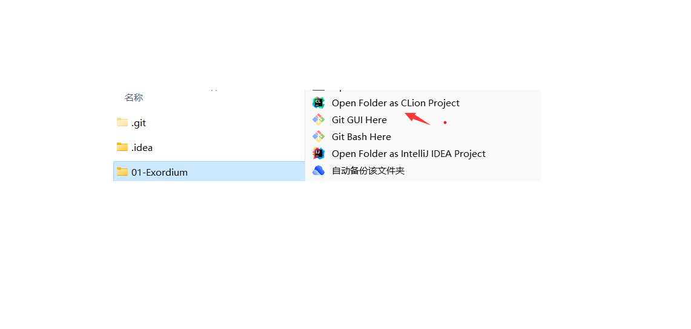
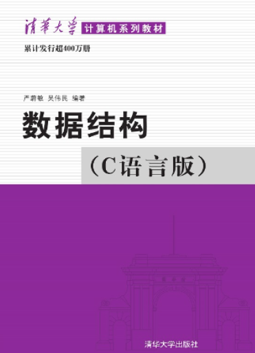

## 为什么 Why

- **基础源码**(数据结构的基本操作)将会以`class`的形式给出，一个`.cpp`文件和一个`.h`文件，在*ipad*上下载**GitHub**应用软件，零散时间可快速打开温习代码，**习题解答**和**应用案例**会另给出一个`main.cpp`文件用于测试

- 每个章节里面一般包含3个文件`TextBook`，`Applied Case`和`Exercise`，分别包括**基础源码**(数据结构的基本操作)和**应用案例**的源码，以及**习题解答**的代码

- 对于在严书中涉及到的算法但**没有**用伪代码实现的, 会补充实现

- 代码主要以**严书**的为主，同时会补充邓书和王道的代码，遇到**完全重复**的算法时，**采用严书的实现方式**

- 命名方式、代码规范选用**严书标准**

- 开箱即用，下载后可以很轻松嵌入`main`函数中自行调试

------


## 教材源码 Source Code

|                            线性表                            |                           栈和队列                           |                       串、数组和广义表                       |                          树和二叉树                          |                              图                              |                             查找                             |                             排序                             |
| :----------------------------------------------------------: | :----------------------------------------------------------: | :----------------------------------------------------------: | :----------------------------------------------------------: | :----------------------------------------------------------: | :----------------------------------------------------------: | :----------------------------------------------------------: |
| <a href="02-Linear List\TextBook\01_SqList\SqList.cpp">顺序表</a> | <a href="03-Stack_Queue/TextBook/01_SqStack/SqStack.cpp">顺序栈</a> | <a href="04-String_ Array_Generalized List\TextBook\01_SString\SString.cpp">顺序串</a> | <a href="05-Tree_Binary Tree/TextBook/01_BiTree/BiTree.cpp">二叉树的操作</a> | <a href="06-Graph/TextBook/01_AdjacencyMatrix/AdjacencyMatrix.cpp">邻接矩阵</a> | <a href="07-Searching/TextBook/01_Search_Seq/Search_Seq.cpp">顺序查找</a> | <a href="08-Sorting/TextBook/01_InsertSort/InsertSort.cpp">直接插入</a> |
| <a href="02-Linear List\TextBook\02_LinkList\LinkList.cpp">单链表</a> | <a href="03-Stack_Queue/TextBook/02_LinkStack/LinkStack.cpp">链栈</a> | <a href="04-String_ Array_Generalized List\TextBook\02_Index_BF\Index_BF.cpp">BF算法</a> | <a href="05-Tree_Binary Tree\TextBook\02_BiThrTree\BiThrTree.cpp">线索二叉树</a> | <a href="06-Graph/TextBook/02_AdjacencyList/AdjacencyList.cpp">邻接表</a> | <a href="07-Searching/TextBook/02_Search_Bin/Search_Bin.cpp">折半查找</a> | <a href="08-Sorting/TextBook/02_BInsertSort/BInsertSort.cpp">折半插入</a> |
| <a href="02-Linear List\TextBook\03_CLinkList\CLinkList.cpp">循环链表</a> | <a href="03-Stack_Queue/TextBook/03_StackAndRecursion/StackAndRecursion.cpp">栈与递归</a> | <a href="04-String_ Array_Generalized List\TextBook\03_next\next.cpp">next函数值</a> | <a href="05-Tree_Binary Tree/Applied Case/DataCompression/HuffmanTree.cpp">数据压缩</a> |    <a href="06-Graph/TextBook/03_DFS/DFS.cpp">DFS遍历</a>    | <a href="07-Searching/TextBook/03_BSTree/BSTree.cpp">二叉排序树</a> | <a href="08-Sorting/TextBook/03_ShellSort/ShellSort.cpp">希尔排序</a> |
| <a href="02-Linear List\TextBook\04_DuLinkList\DuLinkList.cpp">双向链表</a> | <a href="03-Stack_Queue/TextBook/04_SqQueue/SqQueue.cpp">循环队列</a> | <a href="04-String_ Array_Generalized List\TextBook\04_Index_KMP\Index_KMP.cpp">KMP算法</a> | <a href="05-Tree_Binary Tree\Applied Case\BinaryTreeComputeExp\ComputeExpression.cpp">表达式树求值</a> |    <a href="06-Graph\TextBook\04_BFS\BFS.cpp">BFS遍历</a>    | <a href="07-Searching/TextBook/04_B- Tree/B_Tree.cpp">B-树</a> | <a href="08-Sorting/TextBook/04_BubbleSort/BubbleSort.cpp">起泡排序</a> |
| <a href="02-Linear List\TextBook\05_Union\Union.cpp">线性表的并集</a> | <a href="03-Stack_Queue/TextBook/05_LinkQueue/LinkQueue.cpp">链队</a> | <a href="04-String_ Array_Generalized List\TextBook\05_nextval\nextval.cpp">nextval修正值</a> | <a href="05-Tree_Binary Tree/TextBook/03_DisjointSet/DisjointSet.cpp">*并查集</a> | <a href="06-Graph/TextBook/05_MinimumCostSpanningTree/MinimumCostSpanningTree.cpp">最小生成树</a> | <a href="07-Searching/TextBook/05_HashTable/HashTable.cpp">散列查找</a> | <a href="08-Sorting/TextBook/05_QuickSort/QuickSort.cpp">快速排序</a> |
| <a href="02-Linear List\TextBook\06_MergeList\MergeList.cpp">合并有序表</a> | <a href="03-Stack_Queue\Applied Case\Conversion\Conversion.cpp">数制转换</a> | <a href="04-String_ Array_Generalized List\TextBook\06_GList\GList.cpp">广义表</a> |                                                              | <a href="06-Graph/TextBook/06_ShortestPath/ShortestPath.cpp">最短路径</a> |                                                              | <a href="08-Sorting/TextBook/06_SelectSort/SelectSort.cpp">简单选择</a> |
| <a href="02-Linear List/Applied Case/Polynomial/Polynomial.cpp">一元多项式</a> | <a href="03-Stack_Queue/Applied Case/Matching/Matching.cpp">括号匹配</a> | <a href="04-String_ Array_Generalized List\Applied Case\Virus_detection\Virus_detection.cpp">病毒感染检测</a> |                                                              | <a href="06-Graph/TextBook/07_TopologicalSort/TopologicalSort.cpp">拓扑排序</a> |                                                              | <a href="08-Sorting/TextBook/07_HeapSort/HeapSort.cpp">堆排序</a> |
| <a href="02-Linear List/TextBook/SLinkList/SLinkList.cpp">*静态链表</a> | <a href="03-Stack_Queue/Applied Case/EvaluateExpression/EvaluateExpression.cpp">表达式求值</a> | <a href="04-String_ Array_Generalized List/TextBook/Array/Array.cpp">*多维数组</a> |                                                              | <a href="06-Graph/TextBook/08_CriticalPath/CriticalPath.cpp">关键路径</a> |                                                              | <a href="08-Sorting/TextBook/08_MergeSort/MergeSort.cpp">归并排序</a> |
| <a href="02-Linear List/TextBook/Difference/Difference.cpp">*(A-B)∪(B-A)</a> | <a href="03-Stack_Queue/TextBook/LineEdit/LineEdit.cpp">*行编辑</a> |                                                              |                                                              | <a href="06-Graph/Applied Case/SixDegreeSeparation/SixDegree_BFS.cpp">六度空间</a> |                                                              | <a href="08-Sorting/TextBook/09_RadixSort/RadixSort.cpp">基数排序</a> |

**注**：带`*`的为源自其他参考书目的**补充**算法

------


## 编程题解 Solutions

|                            线性表                            |                           栈和队列                           |                       串、数组和广义表                       |                          树和二叉树                          |  图  |                             查找                             | 排序 |
| :----------------------------------------------------------: | :----------------------------------------------------------: | :----------------------------------------------------------: | :----------------------------------------------------------: | :--: | :----------------------------------------------------------: | :--: |
| <a href="02-Linear List/Exercise/2.1_MergeList/MergeList.cpp">2.1</a> | <a href="03-Stack_Queue/Exercise/3.1_DblStack/DblStack.cpp">3.1</a> | <a href="04-String_ Array_Generalized List/Exercise/4.1_CharacterFrequencyStatistics/CharacterFrequencyStatistics.cpp">4.1</a> |                                                              |      | <a href="07-Searching/Exercise/7.1_BinSearch_Cur/BinSearch_Cur.cpp">7.1</a> |      |
| <a href="02-Linear List/Exercise/2.2_MergeList/MergeList.cpp">2.2</a> | <a href="03-Stack_Queue\Exercise\3.2_IsPalindrome\IsPalindrome.cpp">3.2</a> |                                                              |                                                              |      |                                                              |      |
| <a href="02-Linear List/Exercise/2.3_Intersection/Intersection.cpp">2.3</a> | <a href="03-Stack_Queue/Exercise/3.3_InOutS/InOutS.cpp">3.3</a> |                                                              |                                                              |      |                                                              |      |
| <a href="02-Linear List\Exercise\2.4_Difference\Difference.cpp">2.4</a> | <a href="03-Stack_Queue/Exercise/3.4_Postfix/Postfix.cpp">3.4</a> |                                                              |                                                              |      |                                                              |      |
| <a href="02-Linear List/Exercise/2.5_Decompose/Decompose.cpp">2.5</a> | <a href="03-Stack_Queue/Exercise/3.5_Judge/Judge.cpp">3.5</a> |                                                              |                                                              |      |                                                              |      |
|  <a href="02-Linear List\Exercise\2.6_Max\Max.cpp">2.6</a>   | <a href="03-Stack_Queue/Exercise/3.6_LinkQueue/LinkQueue.cpp">3.6</a> |                                                              | <a href="05-Tree_Binary Tree/Exercise/5.6_LevelOrderTraversal/LevelOrderTraversal.cpp">5.6</a> |      |                                                              |      |
| <a href="02-Linear List\Exercise\2.7_Inverse\Inverse.cpp">2.7</a> | <a href="03-Stack_Queue/Exercise/3.7_SqQueueWithTag/SqQueueWithTag.cpp">3.7</a> |                                                              |                                                              |      |                                                              |      |
| <a href="02-Linear List\Exercise\2.8_DeleteMinMax\DeleteMinMax.cpp">2.8</a> | <a href="03-Stack_Queue/Exercise/3.8_Deque/Deque.cpp">3.8</a> |                                                              |                                                              |      |                                                              |      |
| <a href="02-Linear List/Exercise/2.9_Exchange/Exchange.cpp">2.9</a> |  <a href="03-Stack_Queue/Exercise/3.9_Ack/Ack.cpp">3.9</a>   |                                                              |                                                              |      |                                                              |      |
| <a href="02-Linear List/Exercise/2.10_DeleteItem/DeleteItem.cpp">2.10</a> | <a href="03-Stack_Queue/Exercise/3.10_RecursionInLinkList/RecursionInLinkList.cpp">3.10</a> |                                                              |                                                              |      |                                                              |      |

------


## 如何使用 How to use

1. 选用**CLion**(大学生可申请使用免费的教育版本)集成开发环境，配置好C++开发环境

2. 点击该仓库的`Code`绿色按钮，然后点击`Download ZIP`或者直接使用**终端**下载：

```bash
git clone https://github.com/ascendho/KY-DS.git
```


3. 解压，然后选中要打开的文件夹，右键选中`Open Folder as CLion Project`



------


## 常见问题 FAQ

> Q1：源码后缀是cpp，所以需要学习完了c++才能看懂吗？
>
> 答：不，虽然后缀名是cpp，但是也主要是为了使用c++语言的传引用特性以及与严书的"类C语言"同步，教材源码中不会引入其他的c++语言特性，而在部分题解中，为了类型适配方便，会视情况使用标准库`stl`里面的数据结构，但不影响程序逻辑的理解(相反，事实上恰恰方便了程序的理解)。基于此，你只需要基本掌握c语言，就能看懂代码
>
> 
>
> Q2：我可以不使用CLion，采用其他IDE吗？
>
> 答：当然可以，只不过你可能就需要先删除文件夹中CLion相关的配置文件(如CMakeLists.txt)或者直接在网页端复制你需要的代码即可

------


## 参考书目 Bibliography

|            教材            |      作者      |                             图示                             |                           资源链接                           |
| :------------------------: | :------------: | :----------------------------------------------------------: | :----------------------------------------------------------: |
|       数据结构双色版       | 严蔚敏、李冬梅 |  | <a href="https://www.ryjiaoyu.com/book/details/45170">人邮教育</a> |
| 数据结构习题解析与实验指导 |     李冬梅     |   | <a href="https://www.ryjiaoyu.com/book/details/43313">人邮教育</a> |
|     数据结构(C语言版)      | 严蔚敏、吴伟民 |   | <a href="http://www.tup.tsinghua.edu.cn/booksCenter/book_00236807.html">清华大学出版社</a> |
|    数据结构考研复习指导    |    王道论坛    |   |                              /                               |

------


## 推荐资源 Recommended Resources

- <a href="https://www.educoder.net/paths/jizlwfkq">头歌实训平台</a>

- <a href="https://www.bilibili.com/video/BV1nJ411V7bd/?spm_id_from=333.337.search-card.all.click">数据结构与算法基础--青岛大学王卓</a>

- <a href="https://www.bilibili.com/video/BV1b7411N798?p=51&spm_id_from=pageDriver&vd_source=61a8f743f4489a59a143809ed7fb1159">数据结构--王道计算机考研</a>

------


## 声明 Disclaimer

- 该项目**仅用于学习交流**，凡是可能涉及到的版权问题，归**教材原作者所有**

- 本人所贡献的部分，遵从`MIT`协议

最后，如果你认为这个项目帮助到了你，不妨给个star✨!

------


## Star History

[](https://star-history.com/#ascendho/KY-DS&Date)
